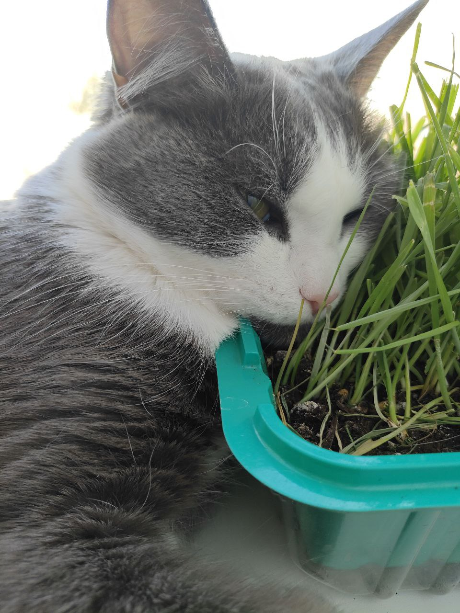
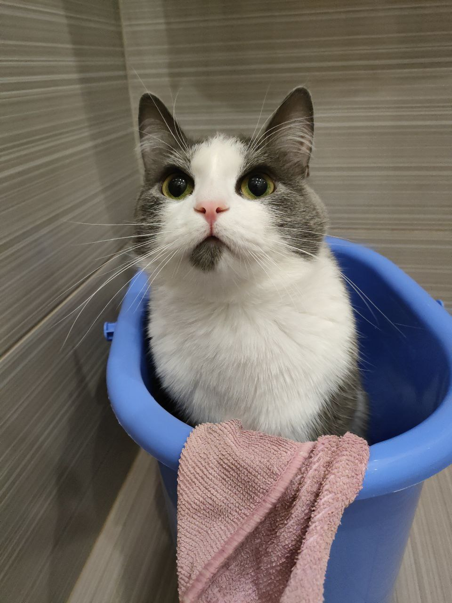
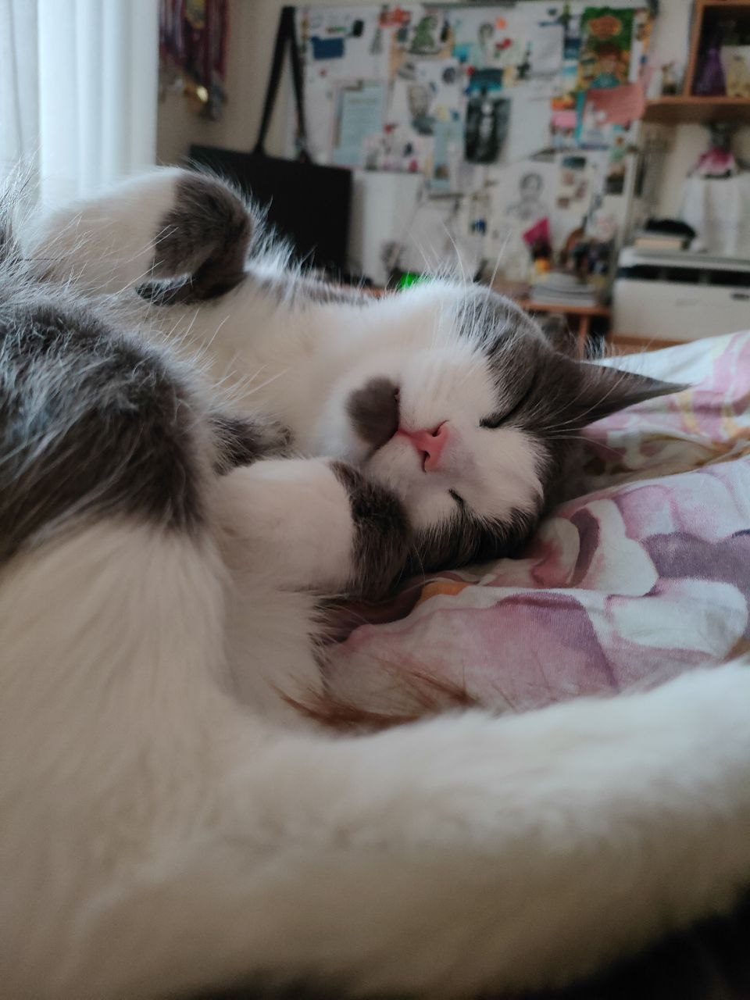

<html lang="ru">
<head>
  <meta charset="UTF-8">
  <title>Мое портфолио(К.К.)
   
  </title>
  
</head>
<body>
  <h1>Мое портфолио😝</h1>
  

    
    <h2>Обо мне</h2>
    
  Привет! Я учусь создавать красивые сайты с помощью кода :) 
      Я начинающий веб-дизайнер и пока мало что умею, но обещаю стараться и учиться новому!))

    

  

  

    <h2>Мои контакты</h2>
         
        
        
<i class="fas fa-envelope"></i> Kovalenkova_k_kurgan@mail.ru

<a href="mailto:Kovalenkova_k_kurgan@mail.ru">Написать письмо</a>
         
        
<i class="fab fa-telegram"></i> @Hungry_for_ever

<a href="https://t.me/Hungry_for_ever" target="_blank" rel="noopener noreferrer">
 Перейти в телеграмм
</a>
  

    <h2>Моя группа поддержки</h2>
    

        

            
            
            
            
Тоша: <i>"Мур-р-р!"</i>

        

    

Нажми на кнопку — получишь комплимент!

<button onclick="generateCompliment()">✨ Получить комплимент</button>

     <button id="no-click" class="btn-danger">🚨 НЕ НАЖИМАТЬ!</button>
    

       Вас взломали! 💻
    

    

        А я предупреждала! 😈
    

</body>
</html>
